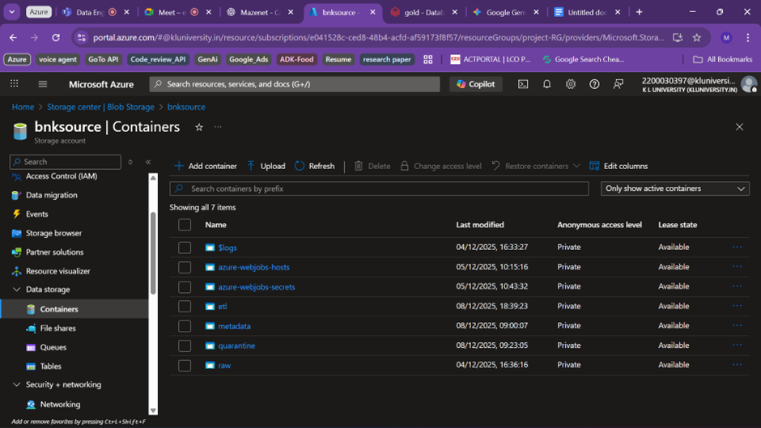
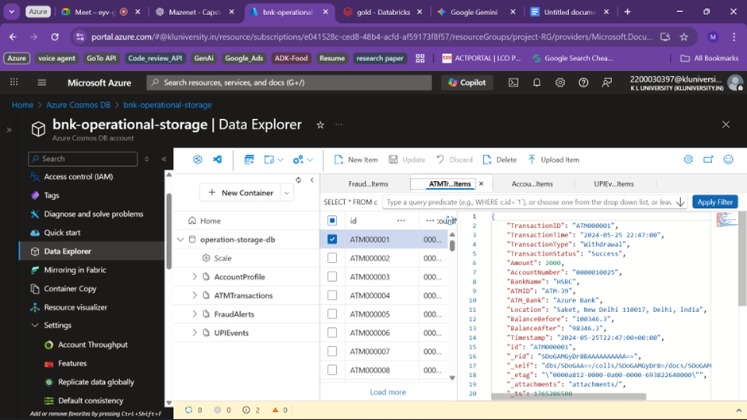
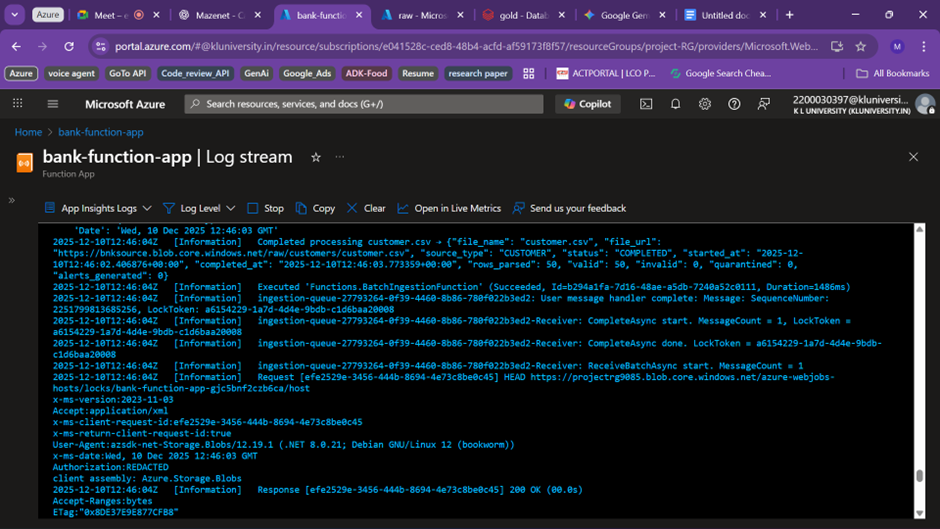
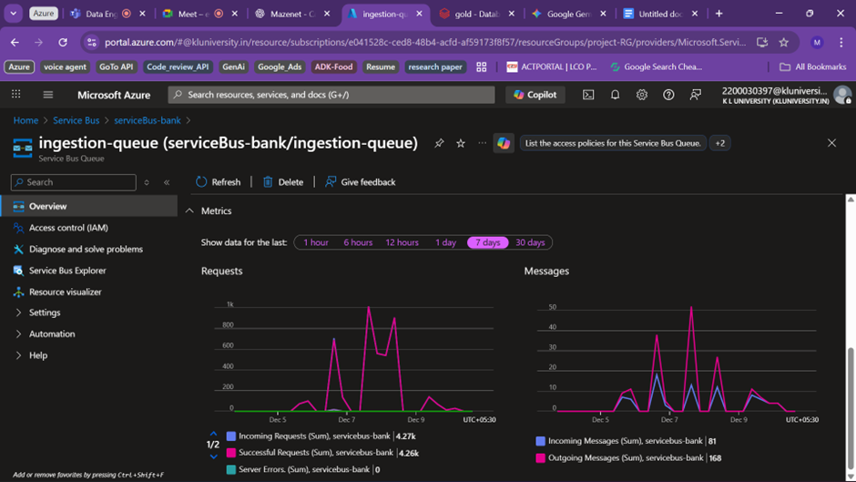
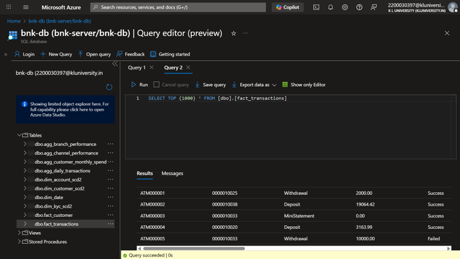

# Azure Bank Platform - Data Engineering Project

## 1. Project Overview

This project is a comprehensive data engineering solution for a modern bank, built on the Microsoft Azure cloud platform. It involves ingesting data from various sources, processing it through a multi-layered data lakehouse architecture, and making it available for analytics and operational use cases.

The primary goal is to build a scalable and robust data platform that can handle batch and real-time data, ensure data quality, and provide a single source of truth for the bank's data.

### 1.1. Business Goals

*   **Create a Single Source of Truth:** To build a centralized data platform that provides a consistent and reliable view of the bank's data across all departments.
*   **Enable Advanced Analytics:** To support various analytical use cases, including business intelligence (BI), reporting, and machine learning (e.g., fraud detection, customer segmentation).
*   **Improve Operational Efficiency:** To automate data ingestion and processing, reducing manual effort and improving data availability.
*   **Ensure Scalability and Performance:** To design a platform that can scale to handle growing data volumes and provide timely access to data.

## 2. Architecture

The project implements a medallion architecture using Azure services:


*   **Azure Data Lake Storage (ADLS) Gen2:** The primary data lake for storing data in all three layers (Bronze, Silver, Gold).
*   **Azure Cosmos DB:** Used as the source for real-time transactional data, simulating an operational database.
*   **Azure Databricks:** The core data processing engine, used to run Spark jobs for ETL. Delta Lake is used as the storage format to bring reliability and performance to the data lake.
*   **Azure Functions:** Provide serverless compute for orchestration and event-driven processing.
*   **Azure Key Vault:** Used to securely store and manage secrets like connection strings and API keys.

## 3. Technology Stack

*   **Cloud Platform:** Microsoft Azure
*   **Data Storage:**
    *   Azure Data Lake Storage (ADLS) Gen2
    *   Azure Cosmos DB
*   **Data Processing:**
    *   Azure Databricks (using Spark and Delta Lake)
*   **Orchestration & Serverless:**
    *   Azure Functions
*   **CI/CD:**
    *   GitHub Actions
*   **Programming Language:** Python (PySpark)

## 4. Project Structure

```
├── .github/workflows/   # CI/CD workflows
├── data/                # Sample data files and data generator
├── docs/                # Project documentation
├── ETL/                 # Databricks notebooks for the ETL process
│   ├── bronze.ipynb
│   ├── silver.ipynb
│   └── gold.ipynb
├── functions/           # Azure Functions for orchestration
│   ├── BatchIngestionFunction/
│   └── FileArrivalFunction/
├── test/                # Test scripts
└── README.md            # This file
```

## 5. ETL Pipeline (Bronze, Silver, Gold)

The ETL process is developed using Azure Databricks and follows the medallion architecture.

#### 5.1. Bronze Layer

*   **Notebook:** `ETL/bronze.ipynb`
*   **Objective:** Ingest raw data from sources into the Bronze layer as Delta tables. This provides a raw, immutable copy of the source data with added metadata like `ingest_time`.

#### 5.2. Silver Layer

*   **Notebook:** `ETL/silver.ipynb`
*   **Objective:** Cleanse, conform, and enrich the data from the Bronze layer. This includes data type correction, handling nulls, and joining datasets to create a unified view.

#### 5.3. Gold Layer

*   **Notebook:** `ETL/gold.ipynb`
*   **Objective:** Create aggregated, business-ready data for analytics and reporting. This involves creating summaries and business-specific data marts (e.g., `customer_summary`).

## 6. Orchestration with Azure Functions

Azure Functions are used to automate and trigger parts of the data pipeline.

*   **`BatchIngestionFunction`:**
    *   **Purpose:** To trigger the batch ingestion of CSV files.
    *   **Trigger:** Can be configured with a Blob Trigger to automatically run when a new `.csv` file is uploaded to the `raw` container in ADLS. This provides an efficient, event-driven approach for batch processing.
*   **`FileArrivalFunction`:**
    *   **Purpose:** To process KYC documents as they arrive in ADLS.
    *   **Trigger:** Uses a Blob Trigger that is filtered to only fire for files in the `kyc-docs` directory.

## 7. CI/CD with GitHub Actions

The project includes CI/CD pipelines to automate testing and deployment.

*   **Continuous Integration (`ci.yml`):**
    *   Triggered on every push or pull request to the `main` branch.
    *   Runs a series of checks, including linting (`black`, `flake8`), type checking (`mypy`), security scanning (`bandit`), and unit tests (`pytest`).
*   **Deploy Functions (`deploy-functions.yml`):**
    *   Triggered on pushes to the `main` branch that include changes in the `functions/` directory.
    *   Deploys the Azure Functions to the configured Function App.
*   **Deploy Databricks Notebooks (`deploy-databricks.yml`):**
    *   Triggered on pushes to the `main` branch that include changes in the `ETL/` directory.
    *   Imports the updated notebooks into the Databricks workspace.

## 8. Setup and How to Run

1.  **Azure Resources:**
    *   Provision Azure Data Lake Storage, Cosmos DB, Databricks, and an Azure Functions App.
2.  **Databricks:**
    *   Import the ETL notebooks into your Databricks workspace.
    *   Configure a cluster and set up secrets in Azure Key Vault to store connection strings.
3.  **Azure Functions:**
    *   Deploy the functions from the `functions` directory.
    *   Configure the function settings and triggers in the Azure portal.
4.  **Data Ingestion:**
    *   Upload sample data from the `data` directory to your ADLS `raw` container. The `BatchIngestionFunction` will trigger for `.csv` files.
    *   Upload KYC documents to the `kyc-docs` folder. The `FileArrivalFunction` will trigger.
5.  **ETL Process:**
    *   Run the Databricks notebooks in sequence: `bronze.ipynb`, `silver.ipynb`, `gold.ipynb`.
6.  **Data Consumption:**
    *   Connect BI tools like Power BI to the Gold layer tables in Databricks.

## 9. Documentation Index

For more detailed information on specific parts of the project, please refer to the following documents:

*   **[ETL Process](./ETL/README.md)**: Detailed explanation of the Bronze, Silver, and Gold ETL pipelines in Databricks.
*   **[Azure Functions](./functions/README.md)**: In-depth guide to the serverless functions, including their structure, deployment, and configuration.

## 10. Appendix: Azure Resources

Here are some snapshots of the key Azure resources used in this project:

**ADLS Containers**


**Cosmos DB**


**Event Hub**


**Function App Logs**


**Service Bus Queue**


**SQL DB**

